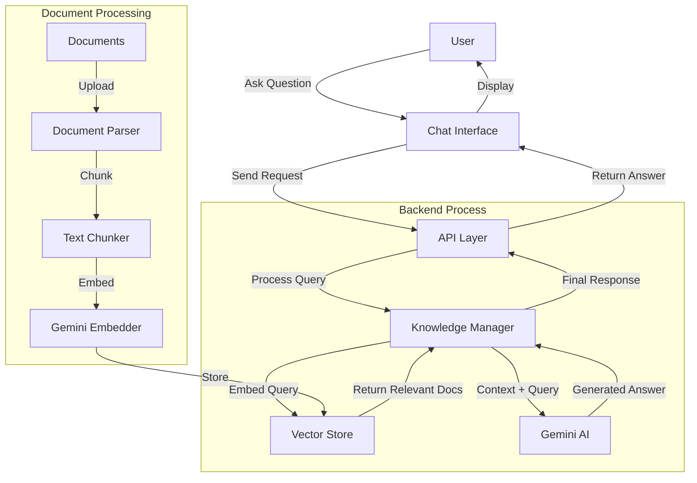
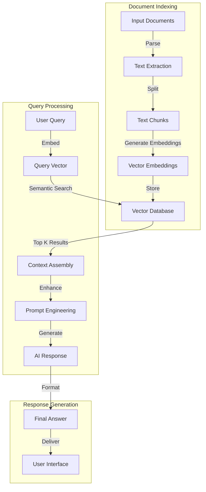

# AI-Powered Luluu Knowledge Hub

An intelligent enterprise knowledge base system powered by Google Gemini AI, providing smart Q&A and knowledge management capabilities.

## 🌟 Core Features

- 💬 Intelligent Chat: Natural language interaction powered by Google Gemini
- 📚 Knowledge Management: Automatic document parsing and knowledge vectorization
- 🔍 Smart Retrieval: Efficient knowledge matching algorithms
- 🚀 Real-time Response: Fast and accurate answer generation

## 🔧 Tech Stack

### Frontend
- React
- Vite

### Backend
- Node.js
- Express
- Google Gemini API
- Vector Store

## 🎯 Key Functions

1. **Intelligent Q&A**
   - Natural Language Understanding
   - Context-aware Conversations
   - Real-time Responses

2. **Knowledge Management**
   - Automatic Document Parsing
   - Knowledge Vectorization
   - Smart Matching & Retrieval

## 📦 Project Structure 

## 🛠 RAG Implementation Details

### 1. Document Processing Pipeline
- **Document Parsing**: Convert various document formats into processable text
- **Text Chunking**: Split documents into manageable segments
- **Embedding Generation**: Create vector embeddings using Gemini API
- **Vector Storage**: Store embeddings for efficient retrieval

### 2. Query Processing
- **Query Embedding**: Convert user questions to vector format
- **Similarity Search**: Find relevant document chunks
- **Context Assembly**: Combine retrieved information
- **Response Generation**: Generate answers using Gemini AI

### 3. Key Components
- `documentParser.js`: Handles document processing and chunking
- `GeminiEmbedding.js`: Manages embedding generation
- `CompanyVectorStore.js`: Handles vector storage and retrieval
- `CompanyKnowledge.js`: Orchestrates the RAG process

## 🔄 System Architecture & Flow

### 🔄 System Workflows

#### 📑 Document Processing
```
Document → Parse(Segment & Clean) → Vectorize/Eembeddings → Store in vector database
     
```

#### 💭 Query Processing
```
Question/Prompt → Vectorize/Eembeddings → Search for relevant documents(vectors) by similarity → Combine → Send the combined to LLMs → Generate → Answer
   
```

### Overall System Flow



### RAG Implementation Detail


## 🚀 Quick Start

1. **Install Dependencies** 
```bash
# Install server dependencies
cd server
npm install

# Install client dependencies
cd client
npm install

2. **Environment Setup**

Frontend (.env in client folder):
```bash
# client/.env
VITE_API_URL=http://localhost:3000
```

Backend (.env in server folder):
```bash
# server/.env
PORT=3000
GEMINI_API_KEY=your_gemini_api_key
VECTOR_STORE_PATH=./data/vector_store
```

3. **Start the Application**
```bash
# Start server (in server directory)
npm run dev

# Start client (in client directory)
npm run dev
```

## 📝 API Documentation

Main API endpoints:
- `POST /api/chat` - Intelligent chat interface
- `POST /api/knowledge` - Knowledge base management
- `GET /api/search` - Knowledge retrieval


## 📄 License

MIT License


## 📞 Contact

- Email: shk741612898@gmail.com
